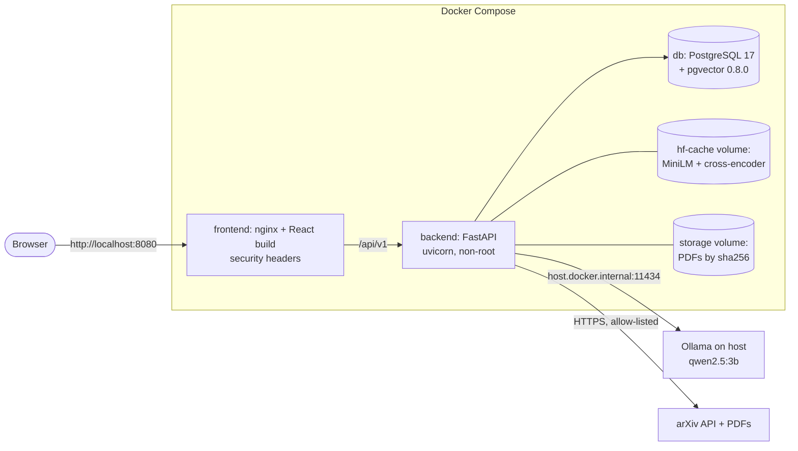
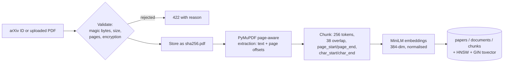

# Architecture Overview

## Context

A single-user/small-team research tool running on one machine (reference: 16 GB RAM, RTX 3050 Laptop 4 GB VRAM,
Ryzen 7 7435HS, Windows 11). All models run locally. The only outbound network dependency is the arXiv API.

```
┌──────────────┐  HTTP /api/v1   ┌──────────────────────────── backend (FastAPI) ────────────────────────────┐
│  frontend    │ ──────────────► │ api/ ──► services/ ──► ingestion/  retrieval/  generation/  evaluation/    │
│ React + Vite │ ◄────────────── │                │            │           │            │                   │
└──────────────┘                 │                └──────────► db/ (SQLAlchemy repositories) ◄───────────────┘
                                 └──────────────────────────────┬──────────────┬──────────────┬─────────────┘
                                                                │              │              │
                                                    PostgreSQL + pgvector   Ollama (local)  arXiv API (HTTPS)
                                                                         sentence-transformers (in-process)
```

## Components (backend `app/`)

| Package | Responsibility | May depend on |
|---------|----------------|---------------|
| `api/v1/` | Routes, request/response schemas, HTTP error mapping. No SQL, no prompts. | `services/`, `core/` |
| `services/` | Use-case orchestration: ingestion jobs, search, Q&A, summaries, extraction. Transactions. | everything below |
| `ingestion/` | arXiv client, upload validation, PDF extraction, chunking. Pure where possible. | `core/` |
| `retrieval/` | Embedding model wrapper, dense / BM25 / hybrid search, cross-encoder reranker. | `db/`, `core/` |
| `generation/` | LLM provider interface + Ollama adapter, prompt templates, output schemas, citation validation. No DB access. | `core/` |
| `evaluation/` | Metrics (Recall@k, MRR, citation validity, abstention), eval runner, run records. | `services/`, `retrieval/` |
| `db/` | SQLAlchemy models, session management, repositories. | `core/` |
| `core/` | Settings, logging, error types. | — |

Rule: no upward imports (e.g. `ingestion` must not import `api`). Enforced by review.

## Deployment (Docker Compose, all ports on 127.0.0.1)



## Key flows

1. **Ingest:** `POST /papers/arxiv` or `POST /papers/upload` → validate → create a job (queued) → background
   worker: fetch or read the PDF → extract pages → chunk → embed (batched) → store in one transaction per document
   → job `ready` / `failed`.
2. **Search:** embed the query → dense (pgvector cosine) and BM25 (stored `tsvector`) candidates → reciprocal rank
   fusion → cross-encoder rerank (default `hybrid_rerank`; ADR-0008) → ranked chunks with provenance.
3. **Q&A:** validate the question → search → cosine threshold (abstain early if nothing passes) → bounded,
   delimited context → Ollama (JSON schema) → validation → citation resolution against the supplied passages →
   persist query, answer, evidence snapshots → respond.

### Ingestion data flow



### Grounded Q&A data flow (provenance chain)

```mermaid
sequenceDiagram
    participant U as User
    participant Q as QAService
    participant R as Retrieval
    participant O as Ollama
    participant D as PostgreSQL
    U->>Q: question
    Q->>R: hybrid search + rerank (top 6)
    R->>D: dense + BM25 SQL
    D-->>R: chunks (paper, pages, char span, chunk ID)
    R-->>Q: hits with cosine score + rank score
    alt no hit with cosine >= 0.30
        Q-->>U: insufficient evidence (no model call)
    else
        Q->>O: delimited passages P1..Pn + rules + JSON schema
        O-->>Q: claims with citation labels
        Q->>Q: resolve labels against supplied passages only;<br/>drop unsupported or label-only claims
        Q->>D: persist query, answer, evidence snapshots, citations
        Q-->>U: answered (valid citations) or insufficient evidence / withheld
    end
```

## Decisions

See `docs/adr/`. Data model: `docs/architecture/data-model.md`.
